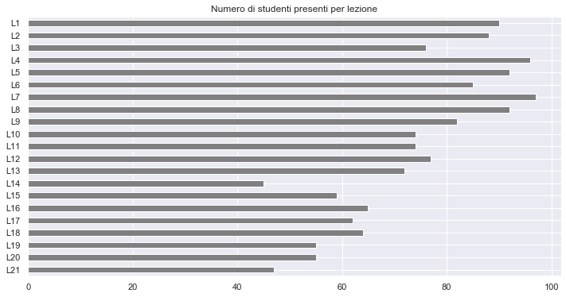
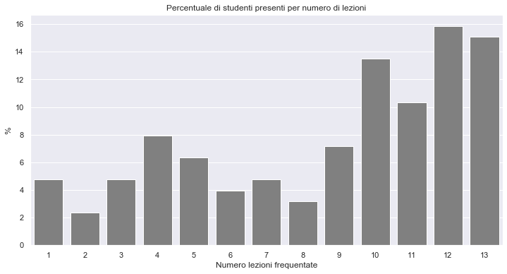
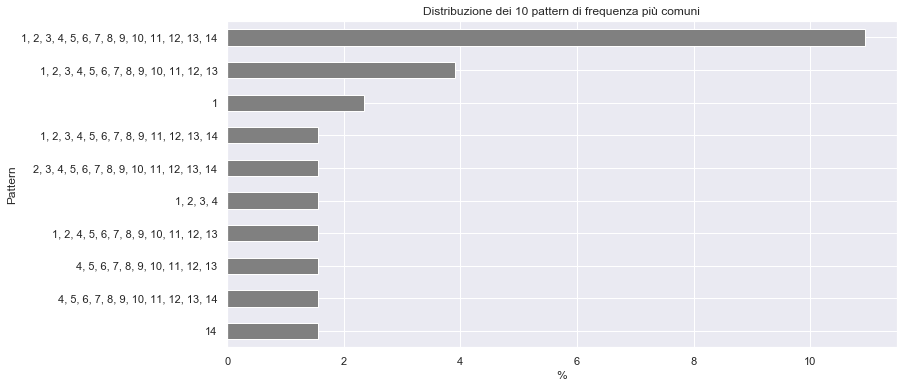
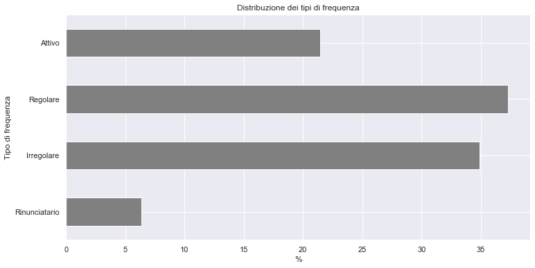

# Analisi della frequenza alle lezioni

Questa pagina contiene una analisi *aggregata* delle informazioni riguardanti la frequenza degli studenti alle lezioni ottenute tramite l'app [lezioniunimi](https://easystaff.divsi.unimi.it/PortaleStudenti/index.php?view=infoapp). Per l'anno accademico in corso, le informazioni raccolte **non hanno alcuna influenza sulla valutazione degli studenti**, o sulle modalità d'esame, ma sono raccolte ai fini di valutare l'andamento generale dell'insegnamento.

Il primo grafico riporta il numero assoluto di studenti presenti 
per ciascuna lezione che si è svolta alla data odierna, in media
sono stati presenti **72.04** (σ=16.32) studenti.

Il grafico seguente riporta la percentuale degli studenti (rispetto al numero 
totale **130** di studenti che hanno assistito ad almeno una lezione), che sono stati 
presenti ad un dato numero di lezioni.

Risulta anche interessante osservare il *pattern* (ossia la sequenza dei numeri di lezione) maggiormente comune tra gli studenti. Il grafico che segue mostra i 10 pattern più comuni.

Risulta interessante *classificare* i pattern di presenza, cercando di dedurre da essi che *tipo* di studente frequentatore essi denotino. Possiamo definire i tipi come segue:

* **attivo** lo studente che ha seguito almeno 2/3 delle lezioni a partire dall'ultima (ossia che ha perso al massimo 1/3 delle lezioni all'inizio del corso),
* **regolare** lo studente che ha seguito almeno 2/3 delle lezioni (comunque siano distribuite 1/3 delle assenze),
* **rinunciatario** lo studente che ha seguito al più 1/3 delle prime lezioni (ossia che ad un certo punto ha smesso di venire a lezione per almeno 2/3 delle ultime lezioni),
* **irregolare** lo studente che non rientra in nessuan delle precedenti categorie.

Tale classificazione è evidentemente arbitraria, ma offre nondimeno una ragionevole interpretazione dei dati raccolti. Il grafico seguente mostra le frequenze dei vari tipi di studenti.

